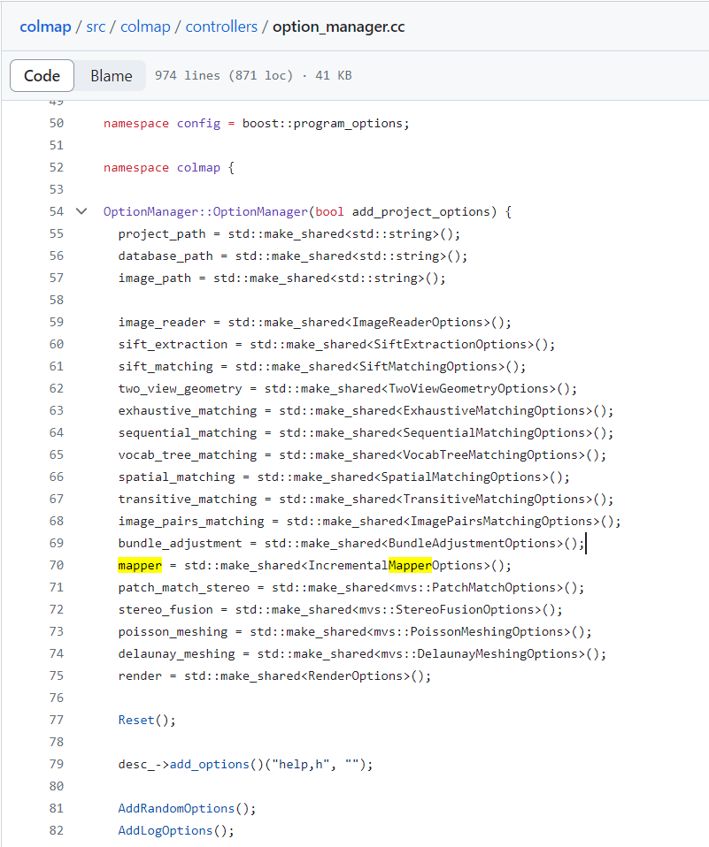
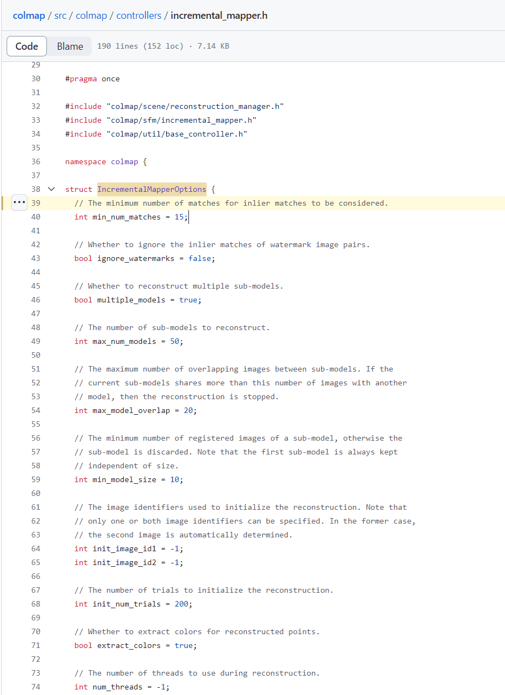
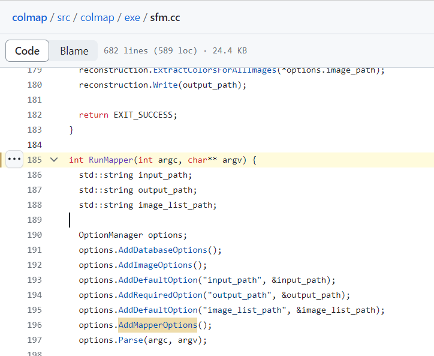
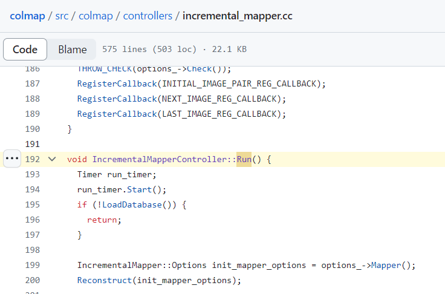
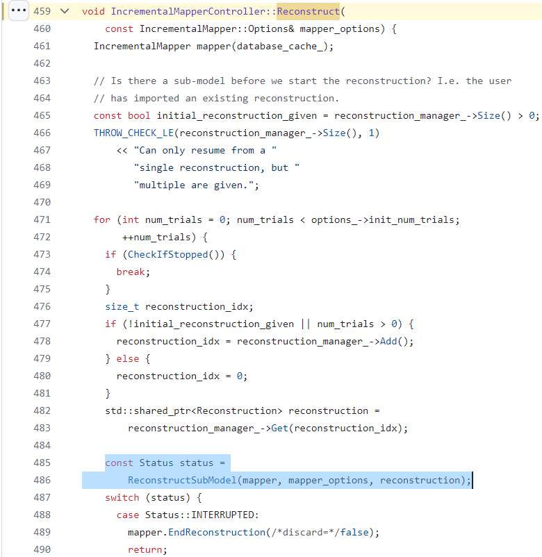
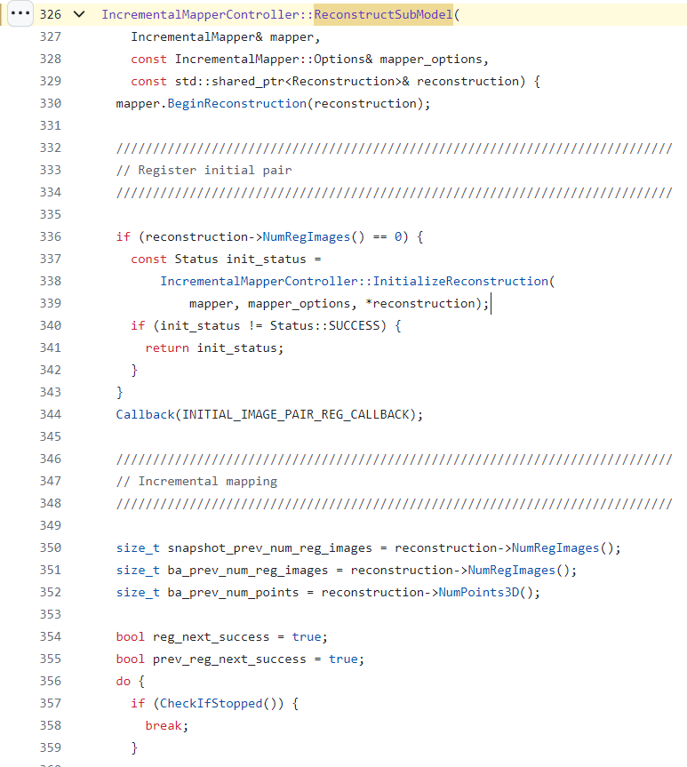
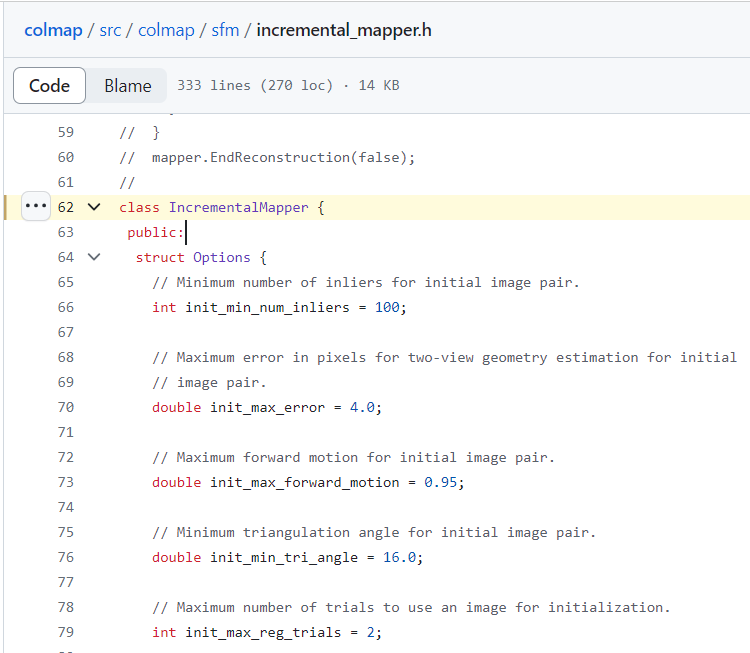
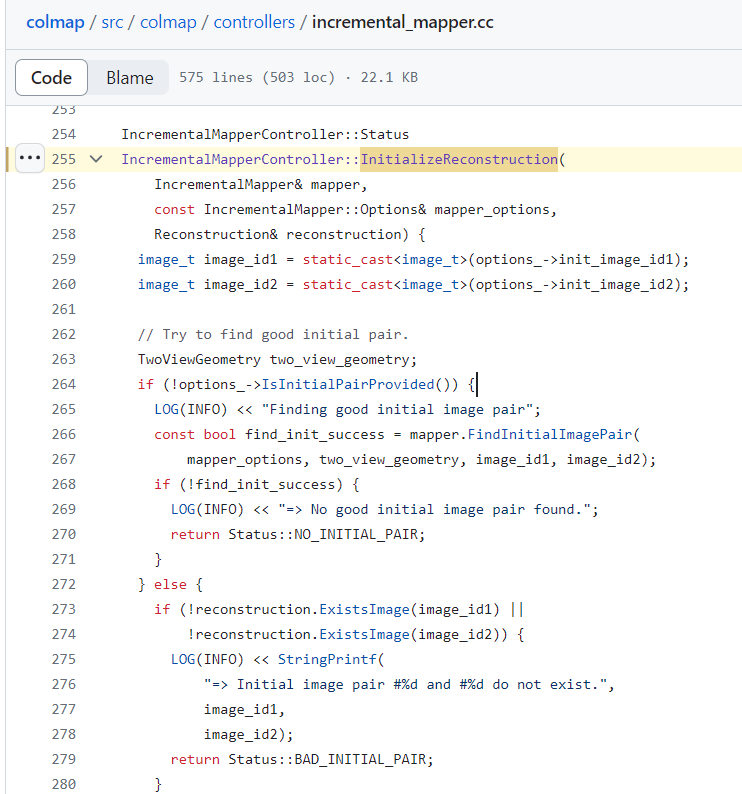

### Command Line Interface Definition

#### command

 https://github.com/colmap/colmap/blob/c0d8926841cf6325eb031c873eaedb95204a1845/src/colmap/exe/colmap.cc

line 89

bind a specific function to a specific cli

#### arguments

https://github.com/colmap/colmap/blob/c0d8926841cf6325eb031c873eaedb95204a1845/src/colmap/controllers/option_manager.h#L61

https://github.com/colmap/colmap/blob/c0d8926841cf6325eb031c873eaedb95204a1845/src/colmap/controllers/option_manager.cc#L477

line 70

Default Value

line 477

Define the command line arguments input

Using places

### Mapper Command Analysis

#### Definition

https://github.com/colmap/colmap/blob/c0d8926841cf6325eb031c873eaedb95204a1845/src/colmap/exe/sfm.h

line 49

https://github.com/colmap/colmap/blob/c0d8926841cf6325eb031c873eaedb95204a1845/src/colmap/exe/sfm.cc#L185

line 185

reading sequence

line 262

https://github.com/colmap/colmap/blob/c0d8926841cf6325eb031c873eaedb95204a1845/src/colmap/controllers/incremental_mapper.cc#L459

line 192 run

line 459 Reconstruct

line 326 ReconstructSubModel

https://github.com/colmap/colmap/blob/c0d8926841cf6325eb031c873eaedb95204a1845/src/colmap/sfm/incremental_mapper.h#L62

line 62 IncrementalMapper

https://github.com/colmap/colmap/blob/c0d8926841cf6325eb031c873eaedb95204a1845/src/colmap/sfm/incremental_mapper.cc

The detail implement of incremental mapper

Back to the previous file https://github.com/colmap/colmap/blob/c0d8926841cf6325eb031c873eaedb95204a1845/src/colmap/controllers/incremental_mapper.cc#L459 line 338

line 255 InitializeReconstruction

