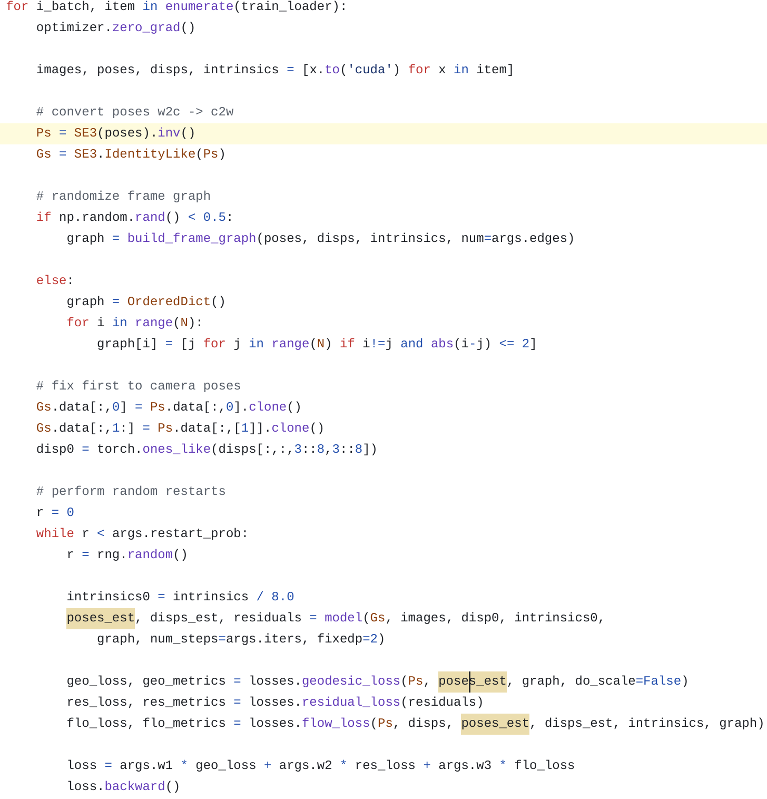

### 相机位姿表示

通过以下内容推断，网络预测得到以及最终存储的相机位姿为camera to world



### 坐标系

直接保存的四元数结果是world to camera pose

可视化过程中输入的是camera to world pose

**camera to world**


**world to camera**

​              

通过实验标定：

初始世界系与相机系重合，因此两者x,y,z轴的取向相同

平举相机面向正前方时，x指向左，y指向上，z指向视线方向

### 注意

相机内参在 DROID-SLAM/droid_slam/motion_filter.py 的 track 函数中以1/8大小保存：

```python
### always add first frame to the depth video ###
        if self.video.counter.value == 0:
            net, inp = self.__context_encoder(inputs[:,[0]])
            self.net, self.inp, self.fmap = net, inp, gmap
            self.video.append(tstamp, image[0], Id, 1.0, depth, intrinsics / 8.0, gmap, net[0,0], inp[0,0])

        ### only add new frame if there is enough motion ###
        else:                
            # index correlation volume
            coords0 = pops.coords_grid(ht, wd, device=self.device)[None,None]
            corr = CorrBlock(self.fmap[None,[0]], gmap[None,[0]])(coords0)

            # approximate flow magnitude using 1 update iteration
            _, delta, weight = self.update(self.net[None], self.inp[None], corr)

            # check motion magnitue / add new frame to video
            if delta.norm(dim=-1).mean().item() > self.thresh:
                self.count = 0
                net, inp = self.__context_encoder(inputs[:,[0]])
                self.net, self.inp, self.fmap = net, inp, gmap
                self.video.append(tstamp, image[0], None, None, depth, intrinsics / 8.0, gmap, net[0], inp[0])

            else:
                self.count += 1
```

