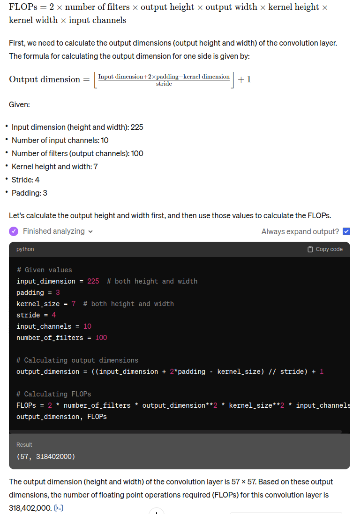
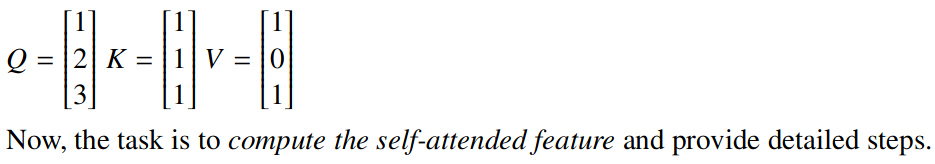

### 1. Briefly describe the purpose of batch normalization in CNNs?

helps reduce “internal covariate shift”, improves optimization, 

Batch normalization in Convolutional Neural Networks (CNNs) is a technique used to standardize the inputs to a layer for each mini-batch. It helps in accelerating the training of deep neural networks by ensuring that the pixels in all feature maps within a convolution layer are set to a new mean and standard deviation. This process involves normalizing the activations of the network, reducing internal covariate shift, and providing a regularization effect to prevent overfitting. Overall, batch normalization plays a crucial role in improving the learning speed, stability, and performance of CNNs by ensuring that the data distribution remains consistent throughout the network during training.

### 2. What is the purpose of zero padding in CNNs?

Zero padding in Convolutional Neural Networks (CNNs) serves the purpose of preserving the spatial dimensions of the input image after convolution. By adding zeros around the borders of the input feature map, zero padding ensures that the output feature map maintains the same size as the input. This technique helps in preventing the loss of information at the edges of the input feature map, which can occur when convolutions are applied without padding. Zero padding is crucial for maintaining edge information, controlling the output size, and ensuring that all parts of the input image are equally utilized during convolution, thus preserving important details throughout the network layers.

### 3. Briefly describe the differences (different properties) between convolution in CNNs and self-attention in vision Transformers.

The main difference between convolution in Convolutional Neural Networks (CNNs) and self-attention in Vision Transformers lies in how they process information. Convolution in CNNs involves applying filters to extract features from local regions of the input data, focusing on spatial relationships within the data. On the other hand, self-attention in Vision Transformers allows the model to selectively focus on different parts of the input based on the importance of each element, without being limited to local spatial relationships. Self-attention mechanisms in Transformers enable the model to learn relationships between elements in the input data, making it particularly effective for tasks involving understanding context and dependencies across the entire input sequence or image. In contrast, convolution in CNNs is more spatially constrained, focusing on extracting features from local regions of the input data.

### 4. Briefly describe the purpose of adding ”Squeeze-and-excite” branch to residual block in Squeeze-and-Excitation Networks.

Adds global context to each residual block!

The "Squeeze-and-Excite" branch is added to a residual block in Squeeze-and-Excitation Networks to enhance the representational power of the network by modeling channel-wise relationships efficiently. This branch focuses on recalibrating channel-wise feature responses by explicitly capturing interdependencies between channels. By incorporating this mechanism, the network can selectively emphasize informative features and suppress less useful ones, ultimately improving the network's performance and generalization across different datasets.

### 5. Briefly describe why the inverted residual block is more memory efficient.

**inverted residual block** is a clever architectural design that enhances memory efficiency in neural networks, particularly in mobile models. Here’s why:

1. **Structure**: The inverted residual block follows a **narrow → wide → narrow** approach, hence the term “inverted.” Let’s break it down:
   - **1x1 Convolution**: It starts with a **1x1 convolution** to narrow the input channels.
   - **3x3 Depthwise Convolution**: Next, it applies a **3x3 depthwise convolution**, which significantly reduces the number of parameters. [This reduction makes the model **faster and more memory-efficient**](https://serp.ai/inverted-residual-block/)[1](https://serp.ai/inverted-residual-block/).
2. **Bottleneck Layers**: The key innovation lies in using **thin bottleneck layers** for both input and output. Traditional residual models use expanded representations, but the inverted residual block connects the bottlenecks. [This approach reduces the memory requirements, especially when dealing with depthwise separable convolutions](https://patrick-llgc.github.io/Learning-Deep-Learning/paper_notes/mobilenets_v2.html)[2](https://patrick-llgc.github.io/Learning-Deep-Learning/paper_notes/mobilenets_v2.html).

In summary, the inverted residual block achieves memory efficiency by employing lightweight depthwise convolutions and maintaining a compact representation throughout the block. It’s a powerful tool for building efficient neural network architectures!

### 6. Briefly describe two similarities and two dissimilarities of ConvNeXt architecture, compared to ResNet.

**Similarities:**

1. **Stages and Blocks:**

    Both ConvNeXt and ResNet architectures are structured into stages with varying numbers of blocks. While ResNet has four stages with different block configurations, ConvNeXt also consists of four stages with a similar concept of blocks per stage, albeit with some adjustments

2. **Depthwise Convolution:**

    ConvNeXt incorporates depthwise convolution in its architecture, a feature shared with ResNet. This type of convolution, where the number of groups equals the number of channels, is utilized in both models, contributing to their performance

**Dissimilarities:**

1. **Stem Design:**

    ConvNeXt introduces a significant change in the stem design compared to ResNet. While ResNet uses a 7x7 convolutional layer for the stem, ConvNeXt adopts a "Patchify" approach with non-overlapping patches and a smaller kernel size, enhancing its efficiency and accuracy

2. **Block Configuration:**

    ConvNeXt diverges from ResNet in the configuration of its blocks. ConvNeXt adjusts the sizes of convolutional layers within a block, inverting the bottleneck structure and altering the placement of layers, leading to differences in performance and computational efficiency compared to ResNet

### 7. Briefly describe grouped convolution and how it is different to standard convolution.

Grouped convolution involves dividing the input channels into separate groups, each processed independently, reducing the number of parameters and computational cost. In contrast, standard convolution operates on all input channels collectively without grouping, leading to higher parameter count and computational complexity.

### 8. Which of the following statements below are true about a CONV layer? 

#### (a) The number of biases is equal to the number of filters (output channels). 

True

#### (b) The total number of parameters depends on the stride. 

False

#### (c) The total number of parameters depends on the padding.

False

### 9. Question Briefly describe the architectural differences between R-CNN (region-based) and Fast RCNN.

R-CNN (Region-based Convolutional Neural Network) and Fast R-CNN are two significant approaches in object detection, each with distinct architectural characteristics:

1. **Region Proposal Generation:**
   - **R-CNN:** In R-CNN, the region proposal generation involves using methods like selective search or edge boxes to generate a set of Regions of Interest (ROIs) within the image[1].
   - **Fast R-CNN:** Fast R-CNN improves upon this by using a single CNN to process the entire image and generate ROIs, eliminating the need to run the CNN on each ROI individually. This change significantly reduces computational costs compared to R-CNN[2].

2. **Feature Extraction and Processing:**
   - **R-CNN:** After generating ROIs, R-CNN uses a CNN to extract features from each ROI separately, followed by classification using a support vector machine (SVM) for predicting the object's class within the ROI[1].
   - **Fast R-CNN:** In contrast, Fast R-CNN feeds the input image directly into a CNN to generate a convolutional feature map. This feature map is then used to identify region proposals, which are reshaped into squares and processed through an ROI Pooling layer to extract fixed-length feature vectors for each proposal. This approach of sharing computations across multiple proposals makes Fast R-CNN faster than R-CNN[2].

In summary, while both R-CNN and Fast R-CNN aim at object detection through region-based approaches, Fast R-CNN introduces architectural improvements that enhance efficiency by processing the entire image once for feature extraction and proposal generation, leading to reduced computational costs compared to the more computationally expensive approach of running the CNN on each ROI individually as done in R-CNN.

### 10. The selective search proposal generation method produces:

#### (a) Class-specific proposals (top-down).

#### (b) Class-agnostic proposals (bottom-up).

#### (c) Both class-specific and class-agnostic proposals (top-down and bottom-up).

The selective search proposal generation method produces **(b) Class-agnostic proposals (bottom-up).** Selective search is a technique used in object detection to identify regions in an image that could potentially contain objects. Unlike methods that generate class-specific proposals, which predict regions based on known classes, selective search is designed to be class-agnostic. It works by segmenting the image into a large number of initial regions and then iteratively merging these regions based on color, texture, size, and shape compatibility. The goal is to produce a set of region proposals that are likely to contain objects, without prior knowledge of what the objects might be. This bottom-up approach allows for flexibility in detecting a wide variety of objects without being constrained by a predefined set of classes.

### 11. Compute the intersection over union between two bounding boxes that are placed at the following four co-ordinates: box1 at {(2,2), (2,4), (4,2), (4,4)} and box2 at {(3,3, (3,5), (7,3), (7,5)}.

To compute the Intersection over Union (IoU) between two bounding boxes, we first need to calculate the intersection area and the union area of the two boxes. Then, we can use these values to compute the IoU score.

Let's start by calculating the coordinates of the intersection rectangle:

For box 1: (2,2), (2,4), (4,2), (4,4) For box 2: (3,3), (3,5), (7,3), (7,5)

The intersection rectangle is formed by the overlapping region of these two boxes. It is given by the coordinates: (3,3), (3,4), (4,3), (4,4).

Now, we calculate the areas of both boxes and the intersection rectangle:

- Area of box 1 = (4 - 2) * (4 - 2) = 4
- Area of box 2 = (7 - 3) * (5 - 3) = 8
- Area of intersection rectangle = (4 - 3) * (4 - 3) = 1

Next, we compute the union area, which is the sum of the areas of both boxes minus the intersection area:

- Union area = Area of box 1 + Area of box 2 - Area of intersection rectangle = 4 + 8 - 1 = 11

Now, we can compute the Intersection over Union (IoU) score:

- IoU = Area of intersection rectangle / Union area = 1 / 11 ≈ 0.0909

So, the Intersection over Union (IoU) between the two bounding boxes is approximately 0.0909.

### 12. Explain the main idea of object proposal generation?

Object proposal generation is a crucial task in computer vision that involves identifying potential regions within an image that are likely to contain objects. The main idea behind object proposal generation is to create a set of candidate regions or bounding boxes that are more likely to encapsulate complete object instances within an image. These proposals serve as hypotheses for the presence and location of objects, aiding subsequent tasks like object detection and recognition.

Object proposal generation methods aim to efficiently generate a diverse set of region hypotheses that cover different object instances in an image. These proposals are typically ranked or scored based on certain criteria, such as the likelihood of containing an object or the quality of the proposal in relation to the ground truth annotations. By generating these object proposals, the subsequent processing steps in computer vision tasks can focus on analyzing and classifying these proposed regions, thereby improving the efficiency and accuracy of object detection and recognition systems.

### 13. Explain the key idea of SSD (by taking not more than 5 sentences)?

### 14. Please indicate if the below statement reagarding SSD is true or false.  The anchor boxes in SSD have the same aspect ratios at each featuremap position.

### 15. Explain any two strengths and weaknesses of YOLO.

### 16. Name any five applications of object detection in airbone sensors?

Five applications of object detection in airborne sensors include:

1. **Agriculture:** Airborne sensors equipped with object detection capabilities are used in agriculture for tasks like crop monitoring, disease detection, and yield estimation.
   
2. **Environmental Monitoring:** Airborne sensors can aid in environmental monitoring by detecting and tracking wildlife, assessing vegetation health, and monitoring changes in land use.

3. **Disaster Response:** Object detection in airborne sensors is crucial for disaster response efforts, enabling the identification of survivors, damaged infrastructure, and hazards in disaster-stricken areas.

4. **Security and Surveillance:** Airborne sensors with object detection capabilities are utilized for security and surveillance purposes, such as monitoring borders, tracking illegal activities, and enhancing public safety.

5. **Infrastructure Inspection:** Airborne sensors can be used for inspecting critical infrastructure like bridges, power lines, and pipelines, detecting anomalies, and ensuring structural integrity.

### 17. What are the issues with Conventional CNN-based Object Detectors? How these issues are addressed in DETR?

### 18. Explain the Bipartite Matching operation employed in DETR. (A high-level description regarding the role of each term in the matching objective is expected, but it is not necessary to provide exact equations. ).

### 19. What are the key differences in the computation of self-attention and cross attention?

**Key Differences in Computation Between Self-Attention and Cross-Attention**

1. **Input Sequences:****Self-Attention:** In self-attention, the input sequence is the same, focusing on interactions within a single sequence.**Cross-Attention:** Cross-attention involves mixing or combining two different input sequences, allowing for interactions between elements of distinct sequences.
2. **Query, Key, and Value Calculation:****Self-Attention:** In self-attention, the query, key, and value matrices are derived from the same input sequence.**Cross-Attention:** For cross-attention, queries are typically derived from one input sequence, while keys and values are derived from the other input sequence. This setup enables the attention mechanism to evaluate interactions between elements of different sequences.
3. **Dimension Matching:****Self-Attention:** In self-attention, the dimensions of the query, key, and value matrices are typically the same.**Cross-Attention:** Cross-attention requires that the embedding dimensions of the two input sequences match to ensure compatibility for computation.
4. **Interaction Scope:****Self-Attention:** Self-attention allows each element in a sequence to attend to all other elements within the same sequence.**Cross-Attention:** Cross-attention enables elements in one sequence to attend to elements in another sequence, facilitating interactions between different modalities or contexts.
5. **Applications:****Self-Attention:** Commonly used in encoder-decoder architectures for tasks like machine translation.**Cross-Attention:** Valuable in scenarios like image-text classification and multi-modal tasks where information from different sources needs to be integrated effectively.

### 20. Explain the key steps of RoI Pooling operation in two-stage object detectors.

RoI (Region of Interest) Pooling is a crucial operation in two-stage object detectors like Faster R-CNN. The key steps involved in RoI Pooling are as follows:

1. **Region Proposal Generation:** Initially, the Region Proposal Network (RPN) identifies potential object regions within an image and generates region proposals based on these regions.
2. **RoI Pooling Layer:** The RoI pooling layer takes the region proposals from the RPN and aligns them to a fixed spatial extent, ensuring that features extracted from these regions are of a consistent size for further processing.
3. **Spatial Subdivision:** The RoI pooling operation divides each region proposal into a fixed grid of sub-regions. This subdivision allows for the extraction of features from different parts of the region while maintaining spatial relationships.
4. **Feature Extraction:** Within each sub-region, RoI pooling extracts features using a pooling operation (e.g., max pooling or average pooling) to summarize the information present in that sub-region.
5. **Output Representation:** Finally, the output of the RoI pooling operation is a fixed-size feature map for each region proposal, containing relevant features that can be used for subsequent tasks like object classification and bounding box regression.

By following these key steps, RoI Pooling plays a vital role in standardizing the features extracted from region proposals, enabling effective object detection and localization in two-stage detectors like Faster R-CNN.

### 21. Unlike CNNs, why do vanilla transformers generally not work well for small datasets?

Vanilla transformers generally do not work well for small datasets compared to Convolutional Neural Networks (CNNs) due to their increased data hunger and the absence of the typical convolutional inductive bias present in CNNs. While CNNs embed local properties of the visual domain in their architectural design, transformers need to learn these local features from samples, making them more reliant on data. This lack of inherent local bias in transformers can lead to challenges in learning from limited data, impacting their performance on small datasets.

### 22. Consider a convolution layer (Conv) having input channels=10, filters=100, Kernel=7 × 7, stride=4, pad=3. Let us assume that we are providing an input feature map of size 10 × 225 × 225 to this convolution layer. Here, 225 × 225 is the spatial resolution of the input feature map. Then, what are the number of floating point operations required (FLOPS) for this Conv layer?

### 23. Consider a simple example with three input tokens denoted as X = [t1, t2, t3]. Let us assume that projection matrices have been used to transform each input token into one-dimensional query, key, and value vectors (∈ (R1×1). Hence, we have query, key, and value projections corresponding to these three tokens, which are referred to as Q, K, and V respectively. This means that Q, K, and V for all three tokens are represented as 3 × 1 column vectors, defined as:

To compute the self-attended feature, you follow the steps below:

1. **Calculate the attention scores**: This is done by taking the dot product of the query with all keys, including itself. Since the query, key, and value vectors are one-dimensional in this case, the attention score between a query and a key is just their product.
2. **Apply softmax to get the attention weights**: The softmax function is applied to the attention scores to get the probabilities that determine the weight of the values.
3. **Compute the weighted sum of the values**: Multiply the attention weights with their corresponding value vectors and sum them up to get the self-attended feature for each query.

Here are the steps in detail with the provided Q, K, and V matrices:

a. Compute the dot products $Q \times K^T$ to get the raw attention scores. 

b. Apply the softmax function to each row of the raw attention scores to get the attention weights. 

c. Compute the self-attended feature by multiplying the attention weights with the value matrix V.

Let's go through these steps using the given values for Q, K, and V.

The attention scores, after taking the dot product of Q and $K^T$, are:

$$
\begin{align*} 

\text{attention\_scores} = \begin{bmatrix} 1 & 1 & 1 \\ 2 & 2 & 2 \\ 3 & 3 & 3 

\end{bmatrix}
\end{align*}
$$

Applying the softmax function to these scores gives us the attention weights:

$$
\begin{align*} \text{attention\_weights} = \begin{bmatrix} 0.09003057 & 0.09003057 & 0.09003057 \\ 0.24472847 & 0.24472847 & 0.24472847 \\ 0.66524096 & 0.66524096 & 0.66524096 \end{bmatrix} \end{align*}
$$

Multiplying the attention weights by the value matrix V gives us the self-attended features:

$$
\begin{align*} \text{self\_attended\_features} = \begin{bmatrix} 0.18006115 \\ 0.48945694 \\ 1.33048191 \end{bmatrix} \end{align*}
$$

So the final self-attended features for each query are in the last matrix.