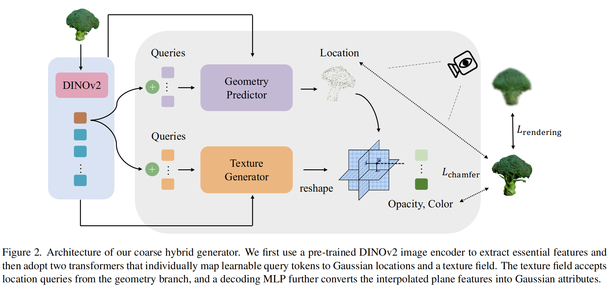
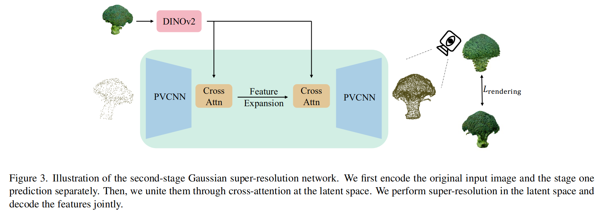
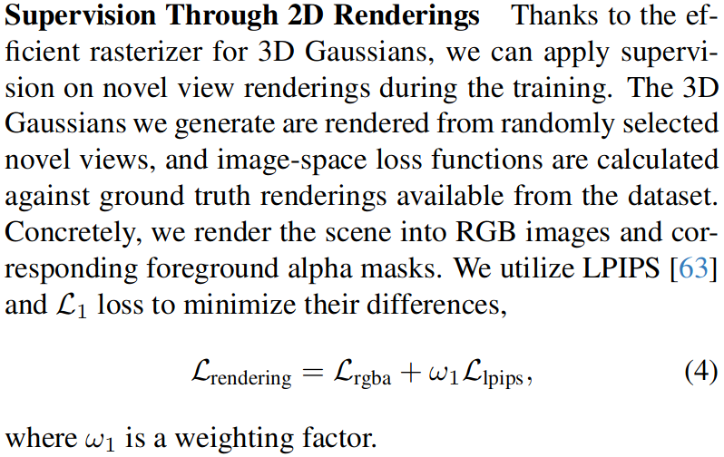

# AGG: Amortized Generative 3D Gaussians for Single Image to 3D

## Abstract

* we introduce an Amortized Generative 3D Gaussian framework (AGG) that instantly produces 3D Gaussians from a single image, eliminating the need for per-instance optimization
* Utilizing an intermediate hybrid representation, AGG decomposes the generation of 3D Gaussian locations and other appearance attributes for joint optimization.
* a cascaded pipeline that first generates a coarse representation of the 3D data and later upsamples it with a 3D Gaussian super-resolution module

## 3. Amortized Generative 3D Gaussians

### Pipeline

#### coarse hybrid generator

The transformer inputs are a set of learnable queries implemented with a group of learnable position embeddings. Each query will correspond to one 3D Gaussian that we generate. Before feeding into the transformer network, the positional embeddings are summed with the global token [CLS] extracted from the DINOv2 model.

### loss function

