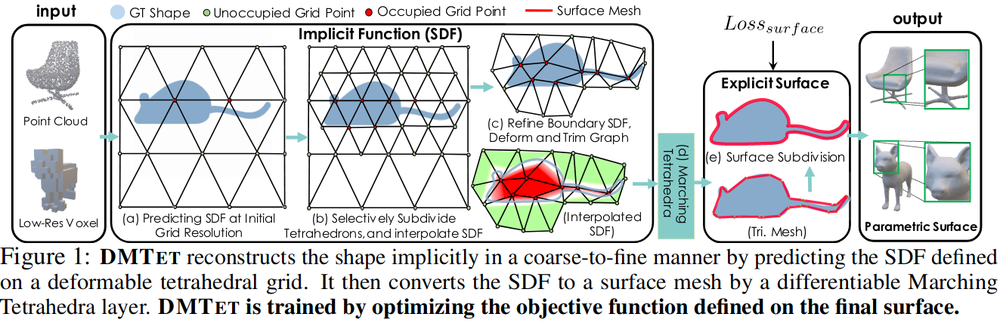
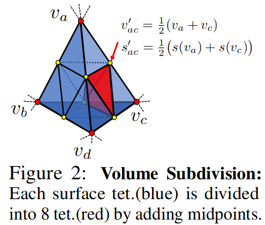
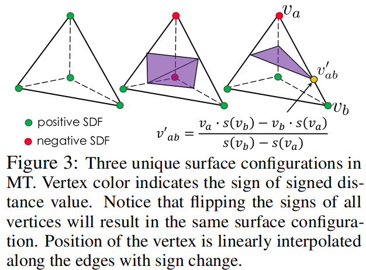
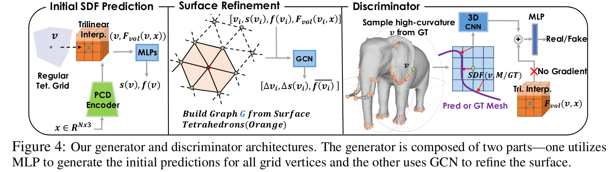
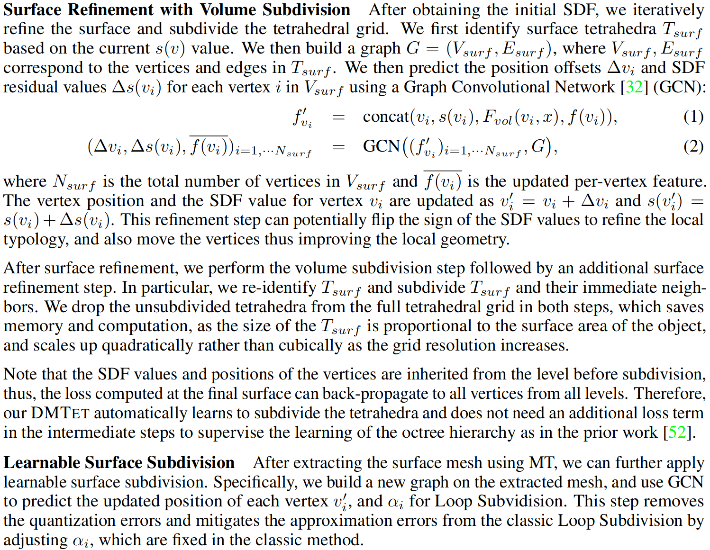
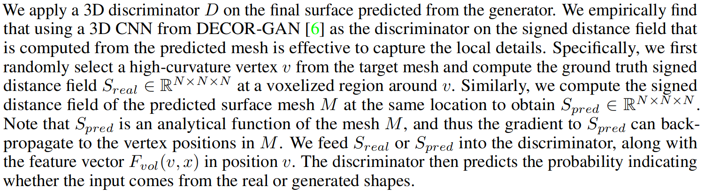
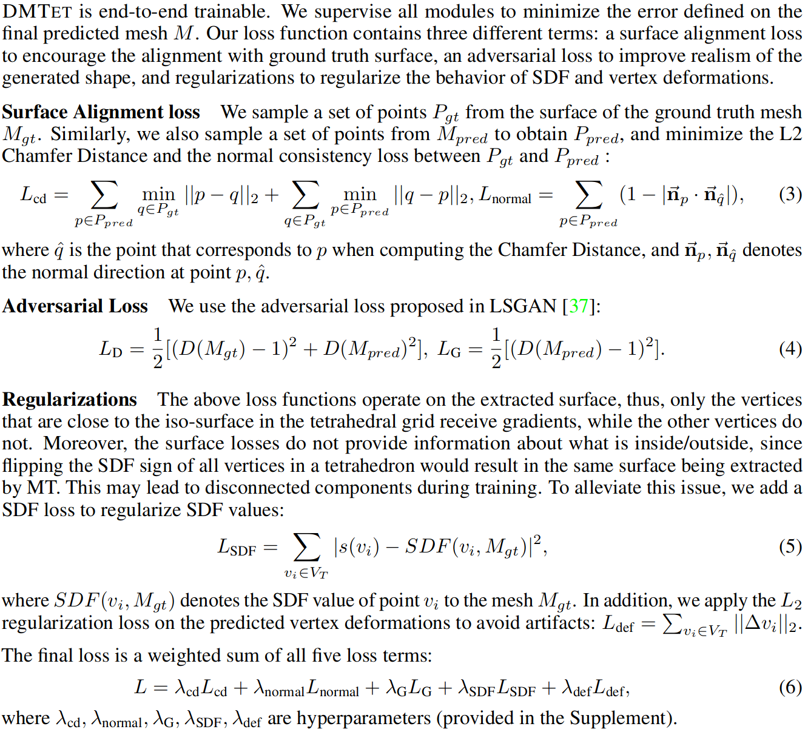

# Deep Marching Tetrahedra: a Hybrid Representation for High-Resolution 3D Shape Synthesis

## Abstract

* synthesize high-resolution 3D shapes using simple user guides such as coarse voxels
* The core of DMTET includes a deformable tetrahedral grid that encodes a discretized signed distance function and a differentiable marching tetrahedra layer that converts the implicit signed distance representation to the explicit surface mesh representation.

## 3.1 Deep Marching Tetrahedra

* represent a shape using a sign distance field (SDF) encoded with a deformable tetrahedral grid.
* We encode signed distance values defined on the vertices of the grid and represent the underlying surface implicitly.
* We further selectively subdivide the tetrahedra around the predicted surface.

### 3.1.1 Deformable Tetrahedral Mesh as an Approximation of an Implicit Function

* denote with ($V_T$ , T ), where $V_T$ are the vertices in the tetrahedral grid $T$
* each tetrahedron $T_k \in T$ is represented with four vertices $\left\{v_{a_k}, v_{b_k}, v_{c_k}, v_{d_k}\right\}$, with $k \in\{1, \ldots, K\}$, where $K$ is the total number of tetrahedra and $v_{i_k} \in V_T$.

* denote the SDF value in vertex $v_i \in V_T$ as $s\left(v_i\right)$
* SDF values for the points that lie inside the tetrahedron follow a barycentric interpolation of the SDF values of the four vertices that encapsulates the point

### 3.1.2 Volume Subdivision

* represent shape in a coarse to fine manner
* We determine the surface tetrahedra $T_{\text {surf }}$ by checking whether a tetrahedron has vertices with different SDF signs - indicating that it intersects the surface encoded by the SDF

### 3.1.3 Marching Tetrahedra for converting between an Implicit and Explicit Representation

Once the surface typology inside the tetrahedron is identified, the vertex location of the iso-surface is computed at the zero crossings of the linear interpolation along the tetrahedron’s edges.

### 3.1.4 Surface Subdivision

* Follow the scheme of the Loop Subdivision method [35], but instead of using a fixed set of parameters for subdivision, we make these parameters learnable in DMTET

* Learnable parameters include the positions of each mesh vertex $v_i^{\prime}$, as well as $\alpha_i$ which controls the generated surface via weighting the smoothness of neighbouring vertices. 

* we only predict the per-vertex parameter at the beginning and carry it over to subsequent subdivision iterations to attain a lower computational cost

## 3.2 DMTET: 3D Deep Conditional Generative Model

DMTET is a neural network that utilizes our proposed 3D representation and aims to output a high resolution 3D mesh M from input x (a point cloud or a coarse voxelized shape).

### 3.2.1 3D Generator

### 3.2.2 3D Discriminator

## 3.3 Loss Function

