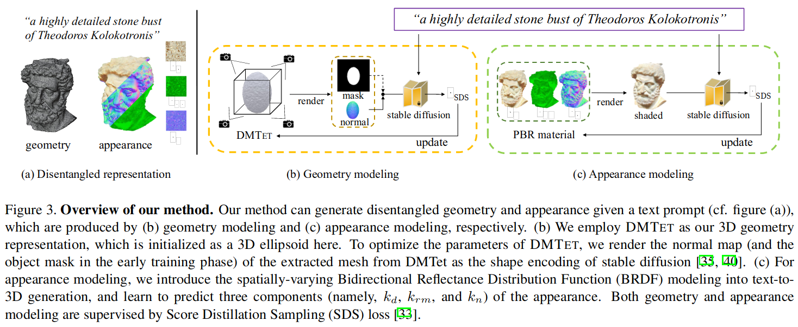
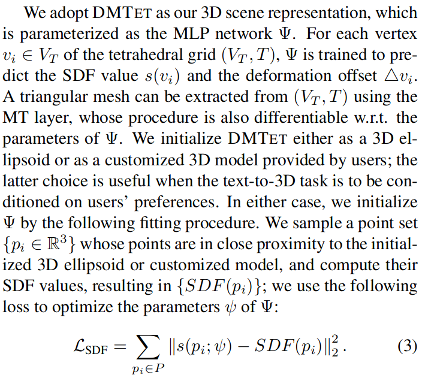

# Fantasia3D: Disentangling Geometry and Appearance for High-quality Text-to-3D Content Creation

## Abstract

* Key to Fantasia3D is the disentangled modeling and learning of geometry and appearance.
* For geometry learning, we rely on a hybrid scene representation, and propose to encode surface normal extracted from the representation as the input of the image diffusion model.
* For appearance modeling, we introduce the spatially varying bidirectional reflectance distribution function (BRDF) into the text-to-3D task, and learn the surface material for photorealistic rendering of the generated surface.

## 4. The Proposed Method

### 4.1. DMTET initialization

### 4.2. Geometry modeling

* given the current DMTET with MLP parameters ψ, we generate a normal map n, together with an object mask o