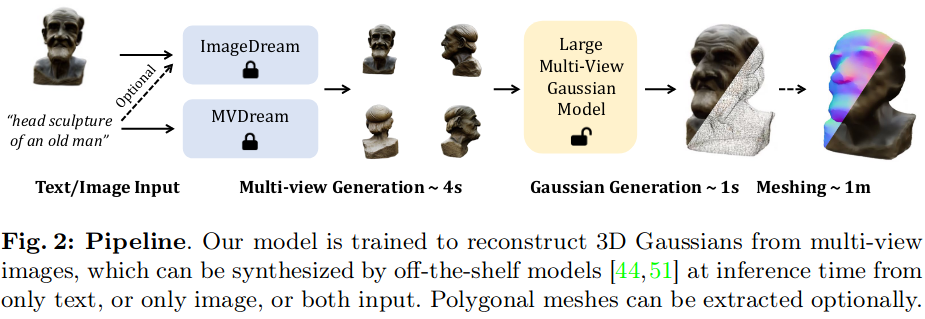
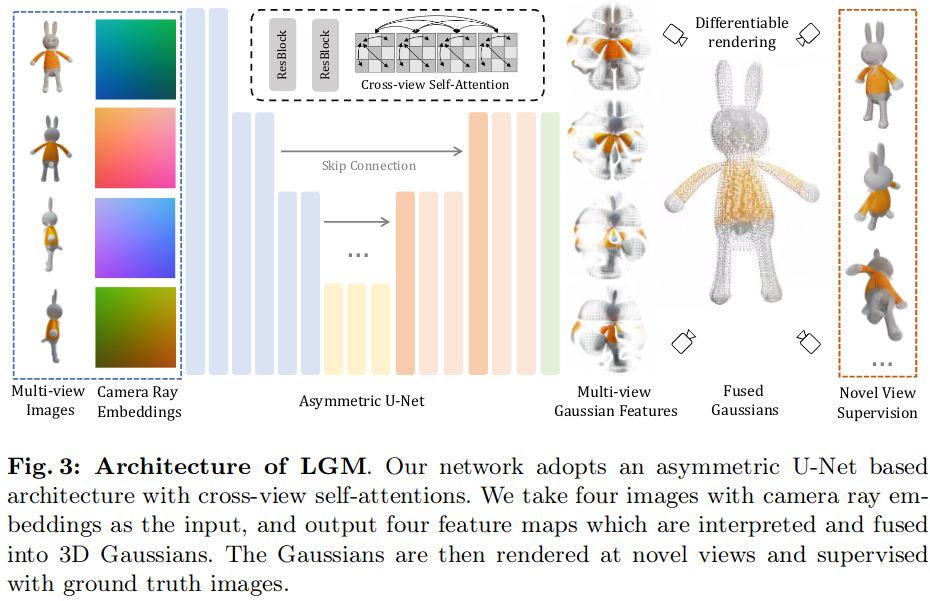
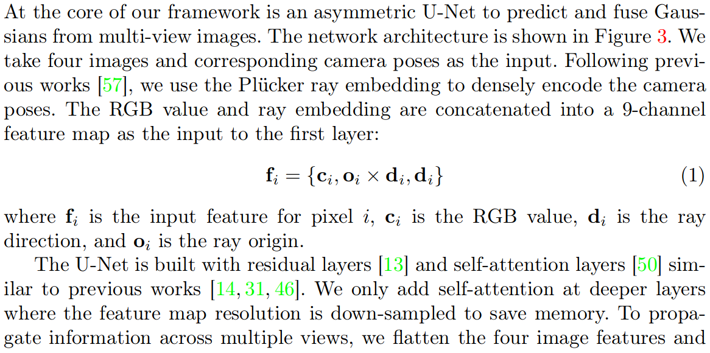
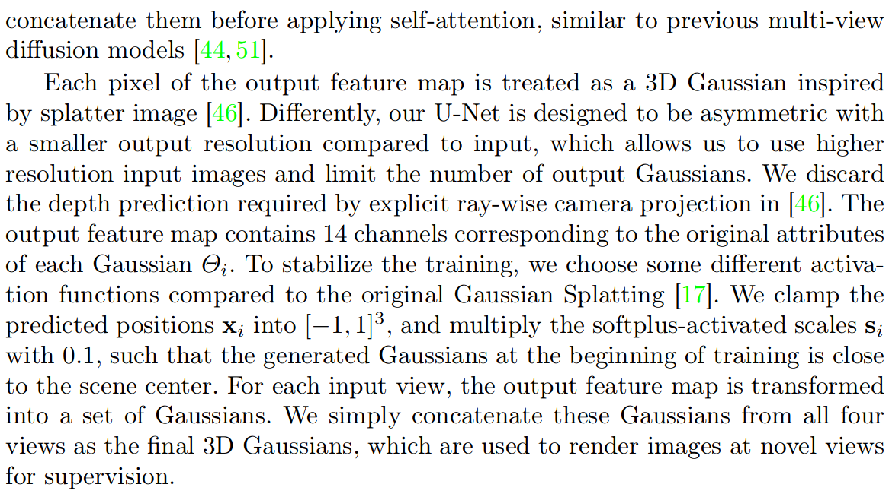

# LGM: Large Multi-View Gaussian Model for High-Resolution 3D Content Creation

## Abstract

* **3D Representation:** A novel framework designed to generate high-resolution 3D models from text prompts or single-view images
* **3D Backbone:** We present an asymmetric U-Net as a high-throughput backbone operating on multi-view images, which can be produced from text or single-view image input by leveraging multi-view diffusion models.

## 3 Large Multi-View Gaussian Model

### The core of the method

