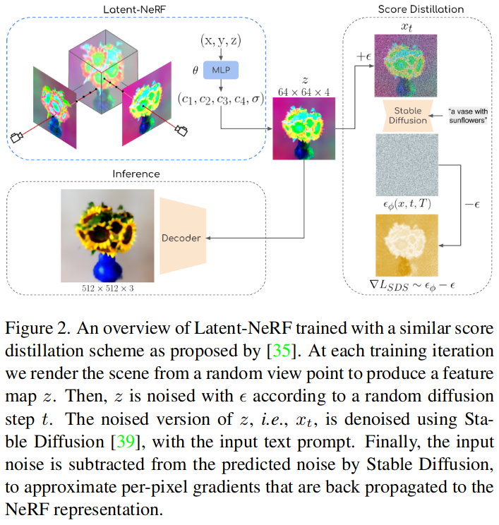
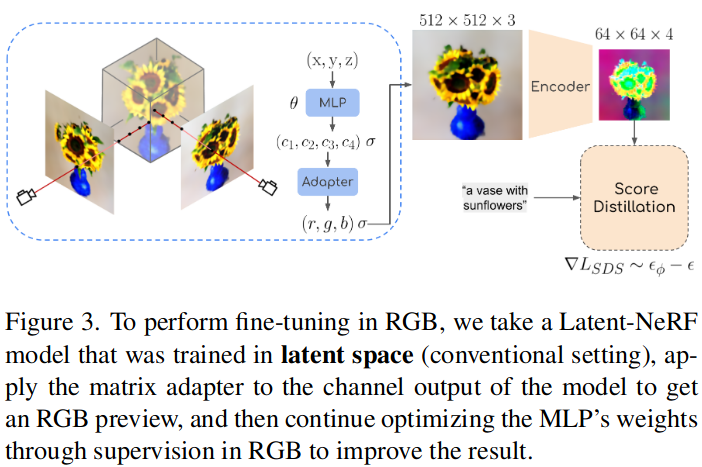
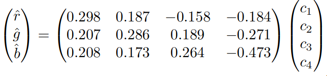

# Latent-NeRF for Shape-Guided Generation of 3D Shapes and Textures

## Abstract

* Bring the NeRF to the latent space, resulting in a Latent-NeRF.
* Guide our Latent-NeRF using a Sketch-Shape: an abstract geometry that defines the coarse structure of the desired object.

## Method

### pipeline

### loss function

$L=\lambda_{S D S} L_{S D S}+\lambda_{\text {sparse }} L_{\text {sparse }}$

The loss $L_{\text {sparse }}=B E\left(w_{\text {blend }}\right)$ prevents floating “radiance clouds” by penalizing the binary entropy of ill-defined background masks wblend. Namely, it encourages a strict blending of the object NeRF and background NeRF.

### RGB Refinement

The initialization empirical linear translation matrix:

### Sketch-Shape Guidance

* We encourage the NeRF’s occupancy to match the winding-number indicator of the Sketch-Shape, but with decaying importance near the surface to allow new geometries. 
* This loss reads as $L_{\text {Sketch-Shape }}=C E\left(\alpha_{N e R F}(p), \alpha_{G T}(p)\right) \cdot\left(1-e^{-\frac{d^2}{2 \sigma_S}}\right)$
* **This loss implies that the occupancy should be well constrained away from the surface, and free to be set by score distillation near the surface.** 
* This loss is applied in addition to the Latent-NeRF loss, over the entire point set $p$ that is used by the NeRF’s volumetric rendering. 
* $d$ represents the distance of $p$ from the surface, and $σ_S$ is a hyperparameter that controls how lenient the loss is, i.e., lower $σ_S$ values imply a tighter constraint to the input Sketch-Shape. 
* Applying the loss only on the sampled point-set $p$​, makes it more efficient as these points are already evaluated as part of the Latent-NeRF rendering process.

### Supplements:

#### Understanding the Winding-Number Indicator in the Context of Latent-NeRF

The winding number indicator, as used in 3D shape generation and specifically in the context of Latent-NeRF, likely serves as a mathematical tool to differentiate between the interior and exterior of shapes. This differentiation is crucial for accurately generating 3D shapes, as it informs the rendering process about which parts of the space are occupied by the object (interior) and which are not (exterior).

The "Fast Winding Numbers for Soups and Clouds" paper presents an efficient method for computing winding numbers, which can be used to determine the "inside" and "outside" of a shape with respect to a point in space. This method is particularly useful in graphics and 3D modeling for accurately defining the surface and volume of complex shapes, such as those encountered in soup-like (meshes without clear volume) or cloud-like (point clouds) structures.

#### The Sketch-Shape Loss Function in Latent-NeRF

1. **Cross-Entropy Loss (CE):** This part of the loss function, \($CE(\alpha_{NeRF}(p), \alpha_{GT}(p))$\), compares the occupancy predicted by the NeRF model  at point \(p\) against the ground truth occupancy . Occupancy here could be related to the winding number indicator, signifying whether a point is inside or outside the shape.

2. **Spatial Weighting:** The term $((1-e^{-\frac{d^2}{2 \sigma_S}})) $applies a spatial weighting based on the distance \(d\) from the point \(p\) to the surface of the sketch-shape. $(\sigma_S)$ controls the spread of this weighting. This ensures that points closer to the surface have a higher influence on the loss, emphasizing the accuracy of the shape's boundary.

